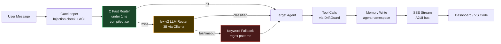
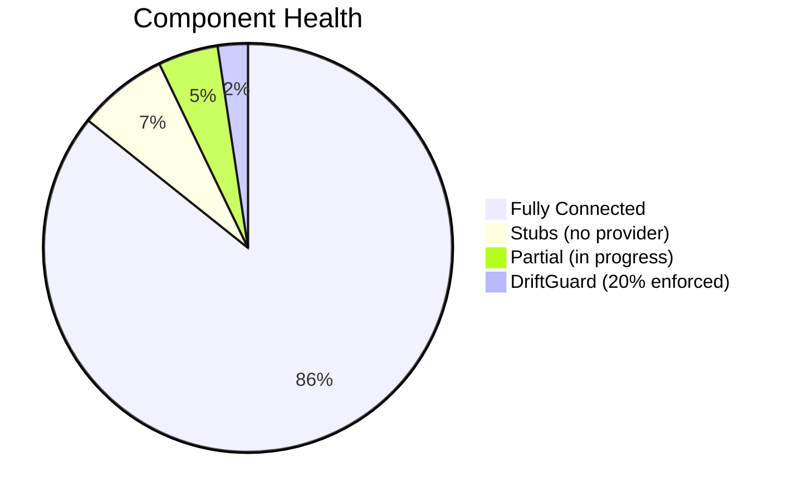

# Agentop Neural Map

> Open this file in **Obsidian** (Reading View) to see the interactive diagrams.
> Last generated: 2026-04-04

---

## Full System Architecture

```mermaid
flowchart TB
    subgraph ENTRY["Entry Points"]
        APP["app.py\nDesktop Launcher"]
        VSCODE["VS Code Extension\n@agentop participant"]
        DISCORD["Discord Bot\ndiscord_bot.py"]
        CURL["HTTP Clients\ncurl / API"]
    end

    subgraph SERVER["FastAPI Server :8000"]
        SECMW["Security Middleware\nHeaders + Rate Limit"]
        AUTH["Auth Gate\nhmac.compare_digest"]
        
        subgraph ROUTES["27 Route Routers"]
            CHAT["/chat — gateway.py"]
            AGENTS_R["/agents — control"]
            GSD["/gsd — tasks"]
            SKILLS_R["/skills"]
            ML_R["/ml + /ml/eval + /ml/training"]
            KNOWLEDGE_R["/knowledge"]
            CONTENT_R["/content"]
            WEBGEN_R["/api/webgen"]
            GATEWAY_R["/v1/chat/completions\nOpenAI compat"]
            OTHER_R["15 more routers\nmemory, sandbox, network\nscheduler, webhooks, etc."]
        end
    end

    subgraph ORCHESTRATOR["LangGraph Orchestrator"]
        subgraph ROUTER["3-Tier Lex Router"]
            C_ROUTER["Tier 1: C Fast Filter\n.so binary — under 1ms"]
            LLM_ROUTER["Tier 2: lex-v2 LLM\n3B model via Ollama"]
            KW_ROUTER["Tier 3: Keyword Fallback\nregex — never fails"]
        end
        C_ROUTER -->|miss| LLM_ROUTER
        LLM_ROUTER -->|fail| KW_ROUTER
    end

    subgraph CORE_AGENTS["21 Core Agents"]
        SOUL["soul_core — T0 CRITICAL"]
        DEVOPS["devops_agent — T1"]
        MONITOR["monitor_agent — T1"]
        HEALER["self_healer — T1"]
        REVIEW["code_review — T2"]
        SECURITY["security_agent — T2"]
        DATA["data_agent — T2"]
        COMMS["comms_agent — T3"]
        CS["cs_agent — T3"]
        IT["it_agent — T3"]
        KNOW["knowledge_agent — T3"]
        OCR_A["ocr_agent"]
        MORE_A["+ 9 more agents"]
    end

    APP --> SERVER
    VSCODE --> CHAT
    DISCORD --> CHAT
    CURL --> SERVER
    CHAT --> AUTH
    AUTH --> SECMW
    CHAT -->|auto route| ROUTER
    CHAT -->|direct agent| CORE_AGENTS
    ROUTER --> CORE_AGENTS

    CORE_AGENTS --> DG
    CONTENT_R --> CONTENT_PIPE
    WEBGEN_R --> WEBGEN_PIPE

    subgraph DRIFTGUARD["Drift Guard Middleware"]
        DG["guard_tool_execution\nIntercepts ALL tool calls"]
        DG_LOG["ToolExecutionRecord\nINV-7 logging"]
        DG_NS["Namespace Check\nINV-4 isolation"]
    end

    DG --> NATIVE
    DG --> MCP_TOOLS
    DG --> BROWSER_TOOLS

    subgraph TOOLS["Tool Layer — 47 Total"]
        subgraph NATIVE["13 Native Tools"]
            T1x["safe_shell"]
            T2x["file_reader"]
            T3x["doc_updater"]
            T4x["system_info"]
            T5x["webhook_send"]
            T6x["git_ops"]
            T7x["health_check"]
            T8x["log_tail"]
            T9x["alert_dispatch"]
            T10x["secret_scanner"]
            T11x["db_query"]
            T12x["process_restart"]
            T13x["document_ocr"]
        end
        subgraph MCP_TOOLS["26 MCP Tools — Docker"]
            GH["GitHub x7"]
            FS["Filesystem x5"]
            DK["Docker x5"]
            OT["Time/Fetch/SQLite/Slack x9"]
        end
        subgraph BROWSER_TOOLS["8 Browser Tools"]
            PW["Playwright\nclick/type/nav/screenshot"]
        end
    end

    subgraph MEMORY["Memory and Data"]
        MSTORE["MemoryStore\nnamespaced JSON"]
        KVEC["Knowledge Vector DB\ncosine search"]
        EVENTS["shared_events.jsonl"]
        SQLITE["SQLite DBs\nscheduler / customer / gsd"]
        AGENT_DATA["data/agents/\nper-agent memory"]
    end

    CORE_AGENTS --> MSTORE
    MSTORE --> AGENT_DATA
    KNOW --> KVEC
    T11x --> SQLITE
    T9x --> EVENTS

    subgraph CONTENT_PIPE["Content Pipeline — 9 agents — ISOLATED"]
        CI1["IdeaIntake"] --> CI2["TrendResearcher"] --> CI3["ScriptWriter"] --> CI4["VoiceAgent STUB"] --> CI5["AvatarVideo STUB"] --> CI6["CaptionAgent"] --> CI7["QA"] --> CI8["Publisher STUB"] --> CI9["Analytics"]
    end

    subgraph WEBGEN_PIPE["WebGen Pipeline — 6 agents — ISOLATED"]
        WG1["TemplateLearner"] --> WG2["SitePlanner"] --> WG3["PageGenerator"] --> WG4["SEO"] --> WG5["AEO"] --> WG6["QA"]
    end

    subgraph REALTIME["Real-Time Layer"]
        WS["WebSocket Hub\n/ws/control"]
        A2UI["A2UI Canvas Bus\nSSE streaming"]
        SCHED["Scheduler\n10 cron jobs"]
    end

    CORE_AGENTS --> A2UI
    SCHED --> CORE_AGENTS
    WS --> FRONTEND

    subgraph EXTERNAL["External Services"]
        OLLAMA["Ollama :11434\nllama3.2 / lex-v2"]
        GLMOCR["GLM-OCR :5002"]
        DOCKER["Docker MCP CLI"]
        FRONTEND["Next.js Dashboard :3007"]
        OPENCLAW["OpenClaw Bridge\nDiscord 40% partial\nTelegram/Slack missing"]
    end

    LLM_ROUTER --> OLLAMA
    CORE_AGENTS -.->|LLM calls| OLLAMA
    T13x --> GLMOCR
    MCP_TOOLS --> DOCKER
    FRONTEND -->|REST polling 5s| ROUTES
    FRONTEND --> WS
    OPENCLAW -.-> CHAT
```

---

## Agent Tiers

```mermaid
graph LR
    subgraph T0["Tier 0 — CRITICAL"]
        SOUL["soul_core\nCluster conscience\nGoal tracking\nTrust arbitration"]
    end

    subgraph T1["Tier 1 — HIGH"]
        DEVOPS["devops_agent\nCI/CD, git, deploy"]
        MONITOR["monitor_agent\nHealth, logs, alerts"]
        HEALER["self_healer_agent\nFault remediation"]
    end

    subgraph T2["Tier 2 — MEDIUM"]
        REVIEW["code_review_agent\nDiff review, drift check"]
        SECURITY["security_agent\nSecret scan, CVE flag"]
        DATA["data_agent\nETL, schema, SQLite"]
    end

    subgraph T3["Tier 3 — STANDARD"]
        COMMS["comms_agent\nWebhooks, incidents"]
        CS["cs_agent\nCustomer support"]
        IT["it_agent\nInfra diagnostics"]
        KNOW["knowledge_agent\nSemantic Q and A"]
    end

    T0 ~~~ T1 ~~~ T2 ~~~ T3

    style T0 fill:#7f1d1d,stroke:#ef4444,color:#fff
    style T1 fill:#713f12,stroke:#f59e0b,color:#fff
    style T2 fill:#1e3a5f,stroke:#3b82f6,color:#fff
    style T3 fill:#1a3333,stroke:#6ee7b7,color:#fff
```

---

## Routing Pipeline

---

## Component Status

| Status | Components |
|--------|-----------|
| **Fully Connected** | 21 core agents, 13 native tools, 27 routes, 10 cron jobs, scheduler, WebSocket, A2UI, memory store, SQLite, security middleware, auth |
| **Stubs** | VoiceAgent, AvatarVideoAgent, PublisherAgent (no real TTS/video/social API) |
| **Partial** | OpenClaw (Discord 40%, no Telegram/Slack), Knowledge Vector Store (no persistence scripts) |
| **Governance Gap** | DriftGuard — intercepts all calls + logging works, but 14/20 invariants are doc-only |

---

## How to Read This

- **Solid arrows** = real function calls / imports that exist in code
- **Dashed arrows** = async or optional connections
- **ISOLATED** pipelines (Content, WebGen) have their own route routers and do NOT go through the main orchestrator
- **STUB** = class exists but no real provider is wired (placeholder logic only)
- **Partial** = partially implemented, has working parts but incomplete
